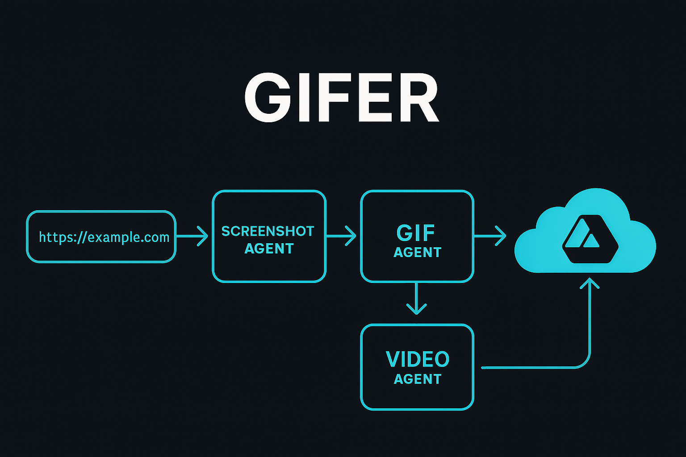

# Gifer

<div align="center">
  
  
  **URL-based Motion Picture Generator**
  
  *Turn ordered screenshots into GIFs or videos with Google Drive storage*
  
  [](https://choosealicense.com/licenses/mit/)
  [](https://www.python.org/downloads/)
  [](https://fastapi.tiangolo.com)
</div>

## 🎯 Overview

Gifer is a powerful automation tool that captures screenshots from web pages across date ranges and converts them into high-quality GIFs or videos. Perfect for creating time-lapse visualizations, monitoring dashboards, or any web-based data that changes over time.

### ✨ Key Features

- 🌐 **Automated Screenshot Capture**: Capture screenshots from any URL across date ranges
- 🎬 **Advanced GIF Compression**: State-of-the-art compression with Gifsicle integration
- 🏷️ **Dynamic Watermarks**: Auto-scaling watermarks that adapt to any image resolution
- 🗺️ **GPSJAM Specialized**: Advanced handling for GPS interference visualization sites
- ☁️ **Google Drive Integration**: Automatic upload and sharing capabilities
- 🔧 **Configurable Rendering**: Advanced page load detection and wait strategies
- 🚀 **High Performance**: Concurrent processing with rate limiting and retry logic
- 🎨 **Professional Quality**: Intelligent compression preserving quality under 14.99MB

## 🔄 How It Works

<div align="center">
  
</div>

1. **🌐 Web Page Loading**: Intelligent page loading with comprehensive wait strategies
2. **📸 Screenshot Capture**: High-quality captures with proper rendering verification
3. **🎬 Media Generation**: Convert screenshots to GIFs or videos with professional quality
4. **☁️ Cloud Storage**: Optional upload to Google Drive with sharing capabilities

## 🚀 Quick Start

### Prerequisites

- Python 3.11 or higher
- Node.js (for Playwright browser binaries)
- Git

### Installation

1. **Clone the repository**:
   ```bash
   git clone https://github.com/Alex-Zeo/Gifer.git
   cd gifer
   ```

2. **Install dependencies**:
   ```bash
   pip install -r requirements.txt
   ```

3. **Install browser binaries**:
   ```bash
   python -m playwright install
   ```

4. **Configure environment** (optional):
   ```bash
   cp .env.example .env
   # Edit .env with your settings
   ```

### Basic Usage

#### 🌍 GPSJAM Monitoring (Recommended)

Capture GPS interference data for any month:

**PowerShell (Windows):**
```powershell
# Generate GIFs for August 2025 (specific script)
pwsh -ExecutionPolicy Bypass -File scripts/generate_august_gifs.ps1 -SecondsPerImage 0.3

# Generate GIFs for any month (universal script)
pwsh -ExecutionPolicy Bypass -File scripts/generate_month_gifs.ps1 -StartDate "2025-09-01" -EndDate "2025-09-30" -SecondsPerImage 0.3
```

**Python (Cross-platform):**
```bash
# Capture screenshots for date range
python scripts/scrape_screenshots.py --start-date 2025-08-01 --end-date 2025-08-31

# Generate GIF with enhanced compression and dynamic watermarks
python scripts/make_gif.py --input-dir "converter/images/gpsjam-2025-08" --output-path "results/gifs/august-2025.gif" --seconds-per-image 0.3 --watermark-prefix "GPSJAM" --compress
# Features: Dynamic watermark sizing, centered placement, intelligent compression under 14.99MB
```

#### 🎬 Custom Website Monitoring

```bash
# Capture any website over time
python scripts/scrape_screenshots.py \
  --start-date 2025-01-01 \
  --end-date 2025-01-31 \
  --output-dir "converter/images/custom-site"

# Create video instead of GIF
python scripts/make_video.py \
  --input-dir "converter/images/custom-site" \
  --output-path "results/videos/january-timeline.mp4" \
  --seconds-per-image 0.5
```

## 🎛️ Advanced Configuration

### Screenshot Options

- **Date Range**: Capture any date range with flexible formatting
- **Viewport Size**: Configurable resolution (default: 1920x1080)
- **Wait Strategies**: Advanced page load detection
- **Retry Logic**: Automatic retry with exponential backoff
- **Rate Limiting**: Respectful crawling with configurable RPS

### Media Generation Options

- **Frame Rate**: Configurable seconds per image
- **Quality Settings**: CRF, presets, and optimization levels
- **Format Options**: GIF, MP4, WebM with different codecs
- **Post-processing**: Cropping, watermarking, and transparency

### Google Drive Integration

```bash
# Upload with public sharing
python scripts/make_gif.py \
  --input-dir "converter/images/data" \
  --output-path "results/gifs/output.gif" \
  --upload-to-drive \
  --make-public
```

## 🗺️ GPSJAM Specialization

Gifer includes advanced support for GPSJAM (GPS interference monitoring) websites:

### 🎯 Automatic Features
- **Smart "More" Button Detection**: Automatically clicks interface buttons to load data
- **Hexagon Overlay Waiting**: Waits for GPS interference visualization to fully load
- **UI Cleanup**: Removes interface elements for clean visualizations
- **Data Validation**: Detects when no data is available vs. still loading

### 📊 Enhanced Reliability
- **Progressive Wait Strategy**: 7-stage loading verification
- **Reduced Concurrency**: 2 workers for stable captures
- **Extended Timeouts**: Generous timeouts for complex map loading
- **Graceful Degradation**: Continues even if some elements fail

## 🏗️ Architecture

### Core Components

- **Screenshot Service**: Playwright-based web automation
- **Media Agents**: GIF and video generation engines
- **Google Drive Service**: Cloud storage integration
- **Render Wait System**: Advanced page load detection
- **GPSJAM Handler**: Specialized domain handling

### File Structure

```
gifer/
├── app/                    # Core application
│   ├── services/          # Business logic services
│   ├── utils/             # Utility functions
│   ├── models/            # Data models
│   └── routers/           # API endpoints
├── scripts/               # CLI tools
├── tests/                 # Test suite
├── docs/                  # Documentation
├── converter/images/      # Screenshot storage
└── results/               # Generated media output
```

## 📚 API Documentation

Start the FastAPI server for web-based interface:

```bash
uvicorn app.main:app --reload
```

Visit `http://localhost:8000/docs` for interactive API documentation.

## 🧪 Testing

Run the comprehensive test suite:

```bash
# All tests
python -m pytest tests/ -v

# Specific test categories
python -m pytest tests/test_gpsjam_handler.py -v  # GPSJAM features
python -m pytest tests/test_render_wait.py -v    # Render waiting
python -m pytest tests/test_ordering.py -v       # Image ordering
```

## 🔧 Development

### Code Quality

```bash
# Linting
ruff check .

# Type checking
mypy .

# Formatting
black .
```

### Contributing

1. Fork the repository
2. Create a feature branch
3. Add tests for new functionality
4. Ensure all tests pass
5. Submit a pull request

## 📁 Output Examples

### Generated Files

- **Screenshots**: `converter/images/gpsjam-2025-08/2025-08-01.png`
- **GIFs**: `results/gifs/gpsjam-august-2025.gif`
- **Videos**: `results/videos/gpsjam-august-2025.mp4`

### Quality Metrics

- **Screenshot Size**: ~3MB per 1920x1080 PNG
- **GIF Compression**: Optimized palettes for smaller file sizes
- **Video Quality**: Configurable CRF settings (default: 18)

## ⚙️ Environment Variables

| Variable | Description | Default |
|----------|-------------|---------|
| `PLAYWRIGHT_HEADLESS` | Run browsers in headless mode | `true` |
| `CONCURRENCY_MAX` | Maximum concurrent screenshots | `2` |
| `PER_HOST_RPS` | Rate limit per host | `4` |
| `GOOGLE_DRIVE_ENABLED` | Enable Google Drive uploads | `false` |

## 📄 License

This project is licensed under the MIT License - see the [LICENSE](LICENSE) file for details.

## 🤝 Support

- 📧 **Issues**: [GitHub Issues](https://github.com/Alex-Zeo/Gifer/issues)
- 📖 **Documentation**: [docs/](docs/)
- 🔧 **API Docs**: `http://localhost:8000/docs` (when running)

## 🎉 Acknowledgments

- Built with [FastAPI](https://fastapi.tiangolo.com) and [Playwright](https://playwright.dev)
- Inspired by the need for reliable GPS interference monitoring
- Designed for production-scale web automation

---

<div align="center">
  <strong>Transform any website timeline into engaging visual content! 🎬</strong>
</div>
